# EWA 영어 학습 앱 플로우 차트

## 1. 전체 사용자 여정 (Overall User Journey)

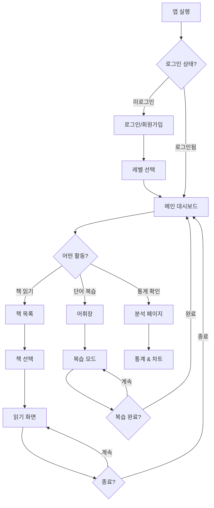

---

## 2. 책 읽기 상세 플로우 (Book Reading Flow)

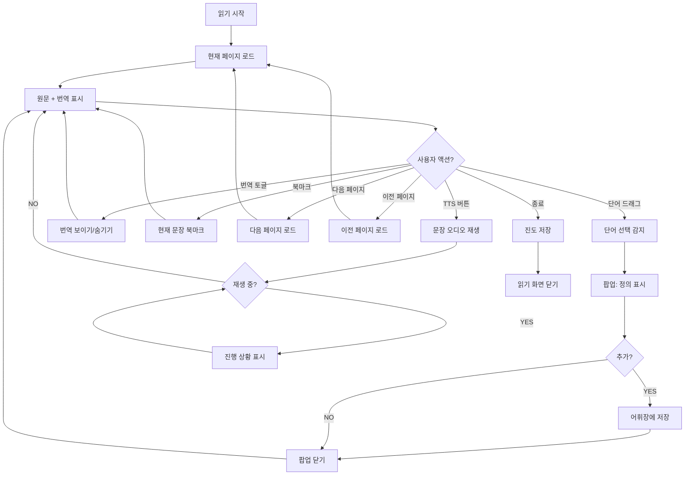

---

## 3. 단어 학습 상세 플로우 (Word Learning Flow)

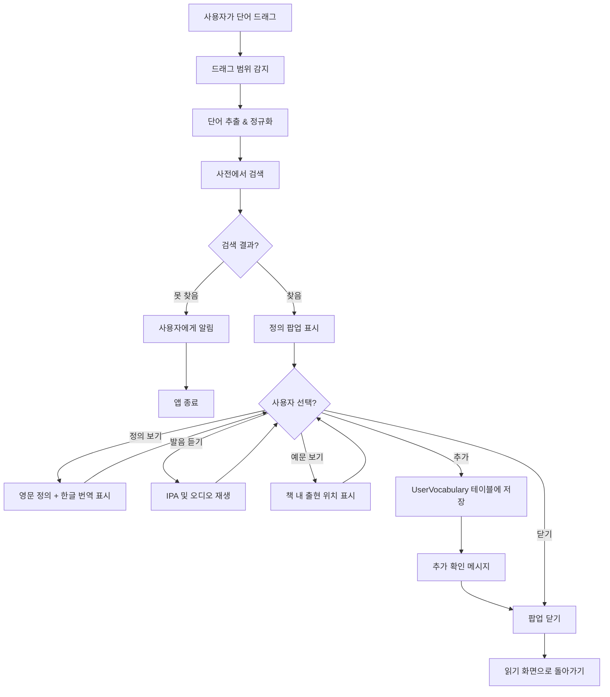

---

## 4. 복습 시스템 플로우 (Vocabulary Review Flow)

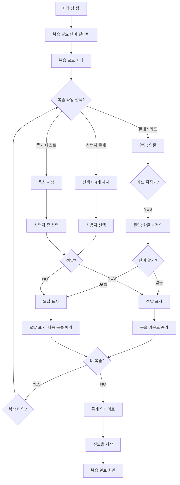

---

## 5. 회원가입 & 초기화 플로우 (Onboarding Flow)

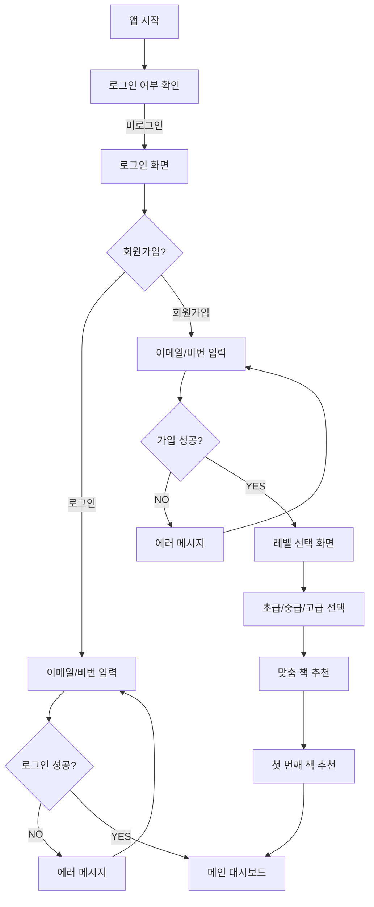

---

## 6. 데이터 플로우 (Data Flow)

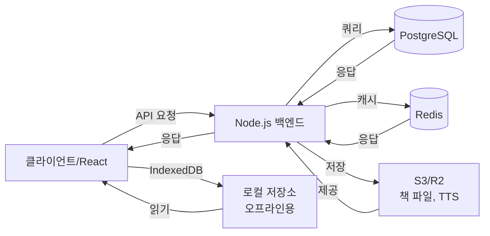

---

## 7. TTS 시스템 플로우 (Text-to-Speech Flow)

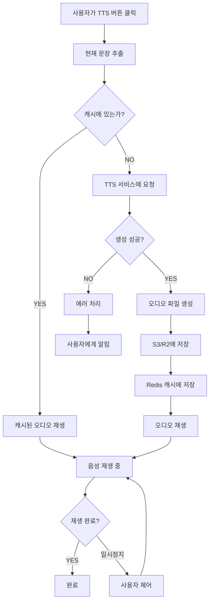

---

## 8. 오프라인 모드 플로우 (Offline Mode Flow)

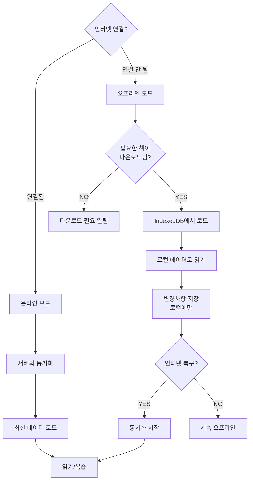

---

## 9. 복습 스케줄 알고리즘 (Spaced Repetition Schedule)

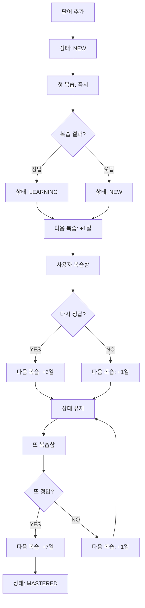

---

## 10. 에러 처리 플로우 (Error Handling Flow)

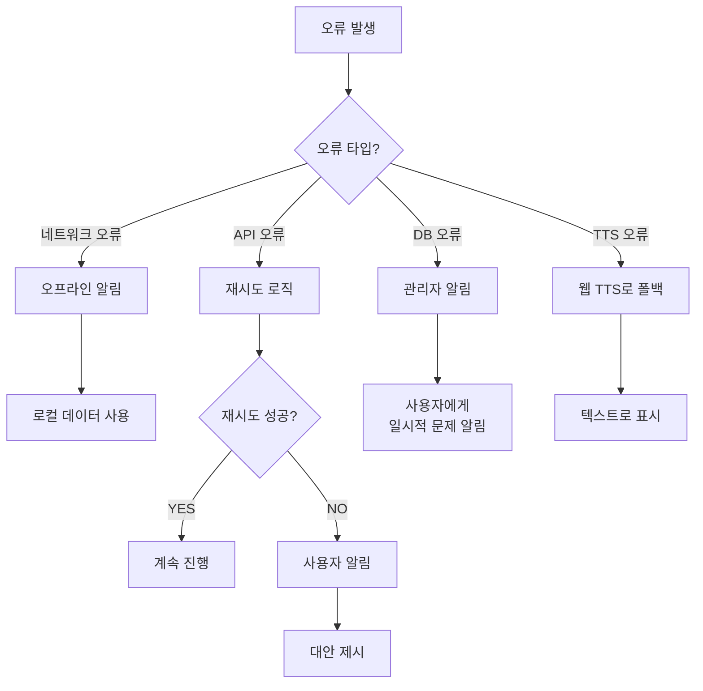

---

## 11. 모바일 & 데스크톱 동기화 (Cross-Device Sync)

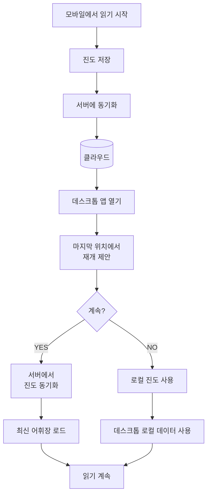

---

## 주요 화면 프로토타입

### 읽기 화면 레이아웃
```
┌─────────────────────────────────┐
│ [←] The Great Gatsby [⚙️]        │
├─────────────────────────────────┤
│ [🔊 TTS] [번역▼] [북마크]       │
├─────────────────────────────────┤
│                                  │
│ English:                         │
│ "So we beat on, boats against   │
│  the current, borne back        │
│  ceaselessly into the past."    │
│                                  │
│ Korean:                          │
│ "그래서 우리는 계속 전진했다,    │
│  현재에 맞서 배를 저어가면서,    │
│  끊임없이 과거로 휩쓸려갔다."    │
│                                  │
│ [이전 페이지] [진도: 245/340]    │
│ [다음 페이지]                    │
│                                  │
└─────────────────────────────────┘
```

### 단어 팝업
```
┌──────────────────────────┐
│ ceaselessly              │
│ /ˈsiːsləsli/ 🔊          │
│                          │
│ [부사] without stopping  │
│ without interruption     │
│                          │
│ [한글] 계속, 끊임없이    │
│                          │
│ 예문:                    │
│ "borne back ceaselessly" │
│                          │
│ [➕ 추가] [닫기] [더보기] │
└──────────────────────────┘
```

### 복습 카드
```
┌────────────────────────────┐
│ 앞면:                      │
│      ceaselessly           │
│                            │
│    [카드 뒤집기] 또는       │
│    [아는가? Y/N]           │
│                            │
│ 진도: ███░░ 30/50         │
└────────────────────────────┘

뒤집으면:
┌────────────────────────────┐
│ 뒷면:                      │
│ [부사] without stopping    │
│ [한글] 계속, 끊임없이      │
│                            │
│ [😊 알았음] [😔 다시]      │
│                            │
│ 진도: ███░░ 31/50         │
└────────────────────────────┘
```
